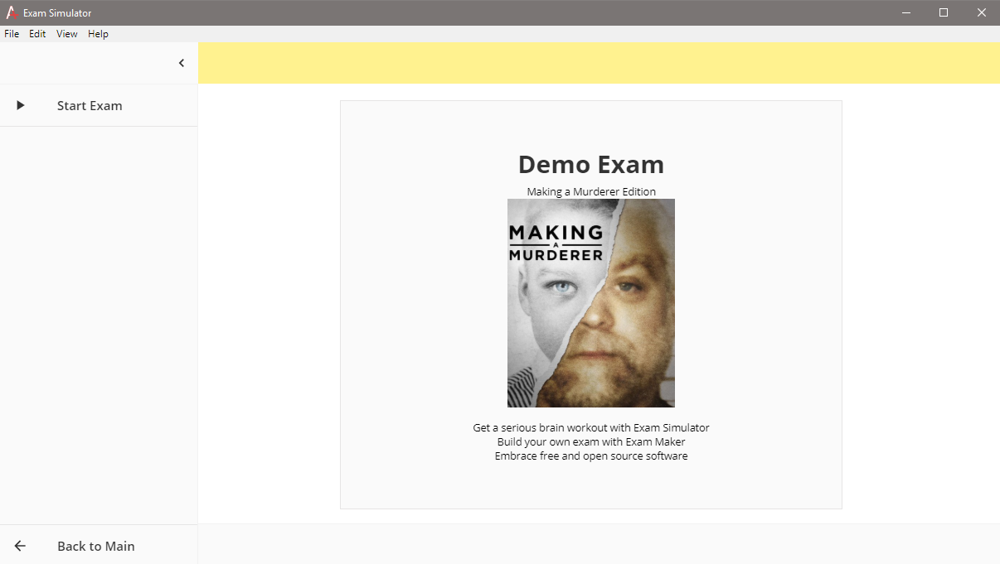
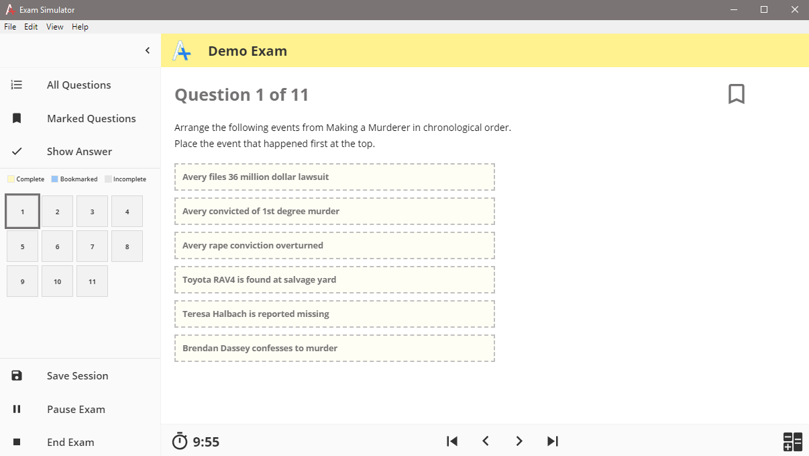
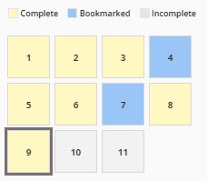
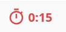
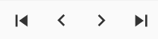

# Getting Started

### Demo Exam

The quickest way to get started is to take the _Demo Exam_ that ships with the software. Click the _Demo Exam_ item and you should see its cover page. The demo is based on the popular documentary _Marking a Murderer_.

To begin the exam click _Start Exam_. 

Taking a test is intuitive and something most of us have done our entire lives. In the user interface you will find various controls to navigate through the exam.

### Exam Controls

The left portion of the screen contains the menu drawer and question grid. Navigate to any question by clicking the corresponding square. Question status is quickly visible by color. _Bookmark_ a question if you aren't sure of the answer or want to review it before ending the exam. Do this my clicking the bookmark icon in the upper right corner. 

Most exams are timed and budgeting available time can be an important skill. The exam timer is located along the footer, on the left. When time is low the display will turn red warning the user. The timer can be disabled in _Settings_. 

Use the navigation arrows to cycle through questions. The interior buttons move to the previous or next question, while the exterior buttons move to the first or last question. 

Toggling between _All Questions_ and _Marked Questions_ in the menu drawer changes the group of question being cycled through. When in _Bookmarked Mode_ a message will be displayed to let the user know.

