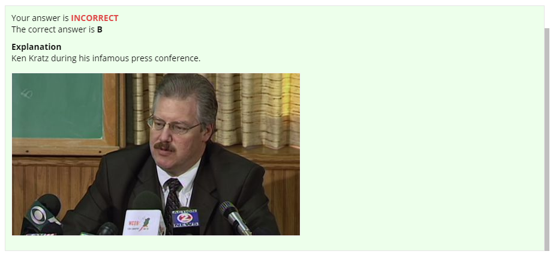

# Getting Started

### Demo Exam

The quickest way to get started is to try the _Demo Exam_ that ships with the software. Click the _Demo Exam_ item and you should see its cover page. The demo is based on the popular documentary _Marking a Murderer_.

To begin the exam click _Start Exam_. 

Taking a test is intuitive and something most of us have done our entire lives. In the user interface you will find various controls to navigate through the exam.

### Exam Controls

#### Question Grid

The left portion of the screen contains the menu drawer and question grid. Navigate to any question by clicking the corresponding square. Question status is quickly visible by color. _Bookmark_ a question if you aren't sure of the answer or want to review it before ending the exam. Do this my clicking the bookmark icon. 

#### Timer

Many exams are timed and budgeting available the clock can be an important skill. The exam timer is located in the footer. When time is low the display will turn red.

#### Arrows

Use the navigation arrows to cycle through questions. The interior buttons move to the previous or next question, while the exterior buttons move to the first or last question. 

#### Question Modes

Switch between _All Questions_ and _Bookmarked Questions_ from the menu drawer to change the group of questions being cycled. 

#### Show Answer

Show are correct answer by clicking _Show Answer_ from the menu drawer. An _Explanation_ box will appear and be scrolled into view. The correct answer, answer status \(Correct/Incorrect\), explanation and notes, if any will appear here. 

#### Pause Exam

Pause the exam by clicking _Pause Exam_ from the menu drawer. The timer will stop, and interaction with the exam is disabled. Click _Resume Exam_ to continue.

#### End Exam

End the exam by clicking _End Exam_ from the menu drawer. A dialog will ask for confirmation and then display a summary of exam results.

